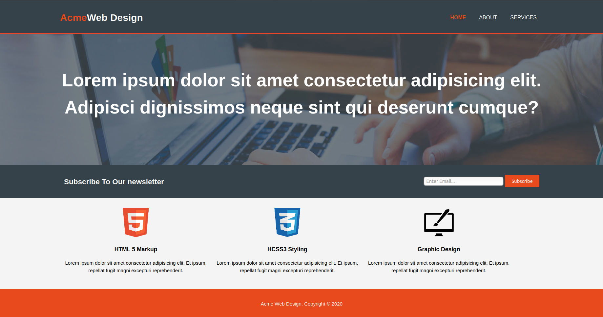

# acme-web-design

> This is a HTML 5 responsive fictional website for a fictional web design company called Acme Web Design. This project is addressed for the absolute beginners and considered a good opportunity not only to build responsive web pages using HTML5 & CSS3, but also to Learn the discipline it takes to plan ahead, break your project into small steps, and finish one step completely before moving on to the next.this is called '''incremental development'''

## Table of contents

* [General info](#general-info)
* [Screenshots](#screenshots)
* [Technologies](#technologies)
* [Setup](#setup)
* [Features](#features)
* [Status](#status)
* [Inspiration](#inspiration)
* [Contact](#contact)

## General info

- HTML 5 & CSS3 responsive web site.
- For absolute beginner .
- Go through HTML 5 semantic tags and HTML in general and CSS3 to build a small website for a web design company.
- The amrkup is simple There is no framework or library.
- Fictional website for a fictional company called Acme Web Design 
- Basic 3 color scheme
- Consist of 3 pages HOME ABOUT SERVICES

## Screenshots

## Technologies

* HTML 5
* CSS 3
* Git & GitHub

## Setup

run with live server from visual studio code.

## Features

* semantic layout
* responsive
* development strategy using Git branches

## Status

Project is: _finished_

## Contact

Created by [@eltayebl](https://github.com/Eltayeb-Elgaali/) - feel free to contact me!